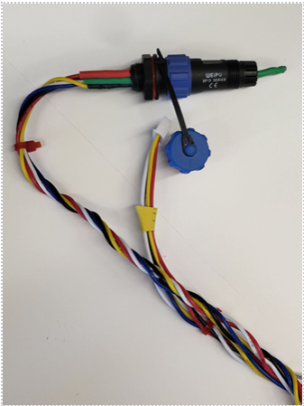
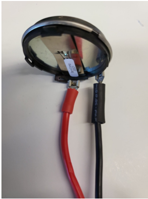
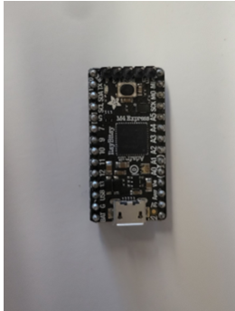

.. _setup-and-assembly:

##################
Setup and Assembly
##################

This section will go over the different components of the sonar system, and the steps which should be followed to 
assemble and set up the the system. All components should be readily available within the lab, or able to be assembled
without too much difficulty.

**********
Components
**********

- **Microphone**: The microphone is what receives the signal (chirp) which is outputted by the transducer and reflected off of a target. 
The microphone is connected to a Weipu connector, which is connected to the hand-twisted wires that connect it to the rest of the system. 
The microphone should always be oriented towards the target. 

- **Transducer**: The transducer takes in a voltage and outputs the signal (chirp). It is connected to the rest of the system by a power and ground wire, 
connected to the connection points on the transducer itself. The transducer should always be oriented towards the target. 

- **Amplifier**: The amplifier takes in a voltage output from the ItsyBitsy and amplified through the PCB board. It then amplifies the signal further and outputs it through the transducer. 
The green LED on the amplifier’s board indicates that it is on and receiving power. 
Diagrams and schematics regarding the amplifier and the PCB it sits on can be found in the Fusion drive, in the “sonar_preamp” folder. 

- **ItsyBitsyM4**: The ItsyBitsy M4 board is the brains of the sonar system. It controls the sending and receiving of the chirp, the conversion of the received signal into a spectrogram, and any other operations. 
If the LED on the itsybitsy is purple, it likely means that the embedded code has already been uploaded. If it is blue, upload the embedded code through Platformio.
The pinout for the itsybitsy can be found `here <http://learn.adafruit.com/introducing-adafruit-itsybitsy-m4/pinouts>`__, and the datasheet for the microchip embedded in the itsybitsy can be found `here <https://ww1.microchip.com/downloads/aemDocuments/documents/MCU32/ProductDocuments/DataSheets/SAM-D5x-E5x-Family-Data-Sheet-DS60001507.pdf>`__.

- **PCB Board**: The PCB board is the board on which the sonar setup sits. The board powers all other components, and ensures that the chirp makes it from the itsybitsy through an amplification circuit on the board, 
then to the amplifier, out through the transducer and back in through the microphone. The red LED on the board being lit means that the board is powered. 
The current version of the board is revision 6. Diagrams and schematics can be found in the Fusion drive in the “rev6” folder within the “Sonar Board” folder.

********
Assembly
********

Assembly of the sonar system is fairly straightforward, as all components have been designed to be easily connected to the PCB board.

The first step is to connect the amplifier to the PCB board. The amplifier has 5 pins on the underside of one end, and 4 pins on the underside
of the other end. Align the pins with their corresponding holes on the PCB board and insert the amplifier into the board. This may take some wiggling,
but should not require excessive force. Some of our PCBs have contact point issues with the amplifier, which can be solved by angling the amplifier 
towards the side of the PCB with the microphone connection. The amplifier should draw roughly 0.15-0.25 A when powered on. If it is drawing less than 
0.05 A, proceed with the aforementioned angling procedure to ensure proper contact, making sure to not move the amplifier while voltage is being applied.
Additionally, the fan on the top of the amplifier should be spinning when powered on. If it is not, this is another sign that the amplifier is not receiving enough power.

-Microphone

-Transducer

-ItsyBitsy

-Power Supply

